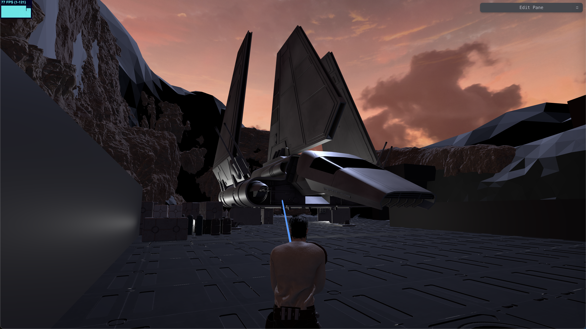

# [PRJ007] The Legend Of Bob

A remake of Raven Software's "Jedi Knight II: Jedi Outcast" written from scratch using [threejs](https://threejs.org/).

- ECS architecture
- [Bullet physics engine integration](https://github.com/kripken/ammo.js)
- [RecastDetour AI navigation](https://github.com/isaac-mason/recast-navigation-js/tree/main)
- [Hierarchical goal network planning AI](https://github.com/Grimrukh/SoulsAI)
- Instanced mesh frustum culling

## How To Run

After cloning the repository, naviagate to the root and run:

`npm install`
`npm run dev`

## Production Build

`npm run build`

To preview the build locally run:

`npm run preview`
